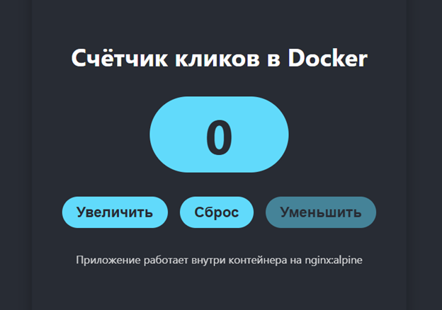

#React Counter App в Docker

**Краткое описание:**  
Простое React-приложение (счётчик кликов), упакованное в Docker‑образ с использованием **многоступенчатой сборки** (Node.js → nginx:alpine). Приложение раздаётся через веб-сервер Nginx внутри контейнера.

---

##Скриншот работающего приложения

  
*Приложение открыто в браузере по адресу http://localhost:8080*

---

##Сборка Docker-образа

Откройте терминал в папке с проектом (где лежит Dockerfile) и выполните:

```bash
docker build -t react-counter-app .